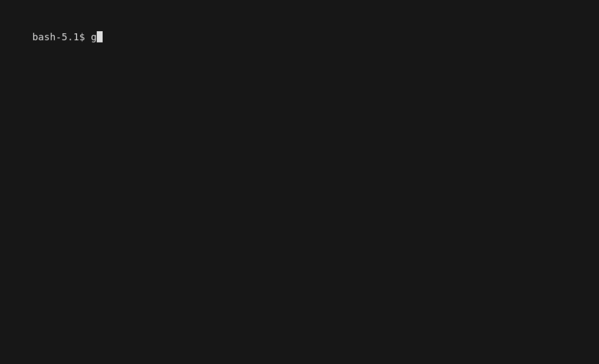

# greyscale

A command-line tool for interrogating greyscale images.

 

## Usage

`greyscale` has a few commands and subcommands:

* `greyscale list` lists the 16 grey names that the other commands use
* `greyscale show info` shows details about the image specified by the `--infile` flag
* `greyscale show colors` shows a histogram of the greys that make up the `--infile` image

The `show info` command's output can be filtered using `--dimensions`, `--width`, or `--height`. 
This can be useful for piping a single piece of information to another command.

`show colors` has several optional flags:

* `--nonzero` filters out any greys that have 0% representation in the image
* `--csv` skips the fancy table rendering and outputs comma-separated values
* `--top n` only shows the histogram lines for the *n* most frequent greys in the image
* `--pixels x,y:n` filters the input to only include pixels starting at `x,y` and including `n` pixels only. If the value of `n` would extend the scope beyond the end of the image, it will include pixels from `x,y` to the end of the image.

## Sample Images

There are a number of sample images in the `samples` folder. The best image to test with is `8bitgreyscale.png`. Some images are included to show how other colorspaces are displayed by `greyscale show info`. 

Worthy of note is the difference between `8bitgreyscale.png` and `32bitgreyscale.png`. Both files look the same visually, but the latter has some slight variation in the grey squares, which is visible in the histogram shown by `greyscale show colors`

## Installation

The easiest way to install is to download the appropriate archive file from the [Releases](https://github.com/rahji/greyscale/releases/latest) page, place the `greyscale` binary  [somewhere in your path](https://zwbetz.com/how-to-add-a-binary-to-your-path-on-macos-linux-windows/), and run it from your terminal (eg: Terminal.app in MacOS or [Windows Terminal](https://apps.microsoft.com/store/detail/windows-terminal/9N0DX20HK701?hl=en-us&gl=us&rtc=1))

**OR** If you have `go` installed you can clone this repo and run `mkdir -p ./bin && make build`

**OR** If you want to use `go install` instead, you can run the following command while making sure to use the [latest version number](https://github.com/rahji/greyscale/tags):

```bash
go install -ldflags="-X 'github.com/rahji/greyscale/cmd.version=1.0.1'" github.com/rahji/greyscale@latest
```

## Notes

It's important to realize that `greyscale` *assumes* your image is actually
greyscale. You can run it against a color image. It just won't produce useful
results.

